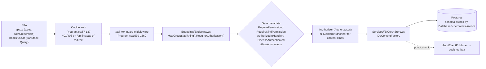
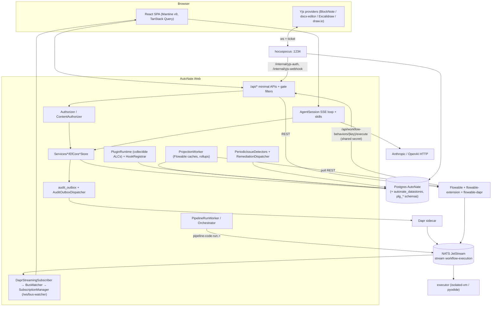

# AutoNate Architecture

One-line summary: a single ASP.NET Core (net10.0) host serving minimal-API endpoints + a Vite-built React 19/Mantine SPA, backed by Postgres (idempotent SQL schema, EF Core stores), with Dapr/NATS JetStream for events, Flowable for workflows, a Hocuspocus sidecar for Yjs collaboration, a NATS-driven code executor sidecar, and a collectible-ALC plugin host.

> Generated from commit 01f0f174 on 2026-08-31 by /n8-map.

Companion: `docs/codebase/Structure.md` (directory map / "where do I put this"). All paths are repo-relative unless absolute. Line numbers are as of the commit above.

---

## 1. Components and boundaries

| Component | Location | Runtime | Talks to |
|---|---|---|---|
| **AutoNate.Web** (host) | `src/AutoNate.Web/` | Kestrel, `:5108` dev | Postgres (`ConnectionStrings:Default`, optional `:Datastores`), Dapr sidecar (`:3500`), Flowable REST (`:8080`), NATS (`:4222`, JetStream provisioning only), Hocuspocus (`ws://localhost:1234`) |
| **SPA** | `src/AutoNate.Spa/` → copied into `src/AutoNate.Web/wwwroot/` at Release/publish (`AutoNate.Web.csproj` target `BuildReactSpa`) | Vite `:5173` in dev via SpaProxy | `/api/*`, `/account/*`, `/ws/bus-watcher`, `/ws/agent-model-default`, `/files/*` (all proxied in `vite.config.ts:59-83`) |
| **Plugin SDK** | `src/AutoNate.Plugin.Abstractions/` (namespace `AutoNate.Plugins.Abstractions`) | Shared assembly (host + every plugin) | — |
| **Plugins** | `plugins/<Name>/` → `dist/<Name>.zip` (MSBuild `AfterTargets="Build"`) | Loaded into a collectible `AssemblyLoadContext` per plugin | Host via `IPluginContext`; own Postgres schema `plg_<code>` |
| **flowable-extension** | `flowable-extension/` (Maven, Java 21, Spring Boot auto-config) | Baked into the custom Flowable image (`infra/flowable/Dockerfile`) | Dapr sidecar `flowable-dapr` (publishes `workflow.execution.events`); calls back to `/api/workflow-behaviors/{key}/execute` |
| **hocuspocus** sidecar | `services/hocuspocus/` (Node 22, `@hocuspocus/server`) | `:1234`, compose service | Postgres `yjs_documents`; `/internal/yjs-auth`, `/internal/yjs-webhook` on the host |
| **executor** sidecar | `services/executor/` (Node, `isolated-vm` + `pyodide`) | NATS subscriber on `pipeline-code-run.>` (core queue subscriber (queue group `executor`) `executor`); compose service `executor` (`make infra-ensure`, health via `executor.health`); Python requests run in single-use worker threads | NATS only |
| **Infra** | `infra/docker-compose.yml` | postgres 16, flowable, flowable-dapr, redis, nats (JetStream), nats-init, dapr-placement, dapr-scheduler, hocuspocus, dapr-dashboard (profile) | — |
| **Tests** | `tests/AutoNate.Web.Tests` (xUnit + `WebApplicationFactory<Program>` over a real local Postgres), `tests/AutoNate.E2E.Tests` (Playwright .NET, boots the host as a child process), `tests/AutoNate.Web.Tests.SamplePlugin` (fixture plugin) | — | Postgres `localhost:5432` |

Boundary rules that hold everywhere:

- The **only** authorization source is the request's `ClaimsPrincipal`. Endpoints gate with filters; stores/skills that touch gated entities go through `IAuthorizer`/`IContentAuthorizer`, never a raw `DbContext` query (`Services/Agent/Skills/IAgentSkill.cs:27-29`).
- Server-to-server callbacks (`/api/workflow-behaviors/*/execute`, `/internal/yjs-*`) are `AllowAnonymous` + shared-secret endpoint filters (`Endpoints/SharedSecretEndpointFilter.cs`, `Endpoints/YjsInternalSecretEndpointFilter.cs`). Browser mutations rely on `SameSite=Strict` cookies and call `.DisableAntiforgery()`; only `POST /account/login` keeps the antiforgery token (`Program.cs:151-194`, `1304-1397`).
- Publishing an event never fails the caller (outbox enqueue, record/notification publishers all log-and-continue).
- Plugins see the host only through `IPluginContext`; `HostServices` is an allowlist (`ILoggerFactory`, `ILogger<T>`, `TimeProvider`, `IHostEnvironment`) — `Plugins/SafePluginServiceProvider.cs:19-31`.

---

## 2. Request flow: SPA → minimal API → filters → stores → Postgres



### 2.1 Middleware order (`src/AutoNate.Web/Program.cs`, 1636 lines, top-level statements)

`Build()` at :1005 → dev Dapr probe :1022-1038 (throws unless `AUTONATE_ALLOW_RUNNING_WITHOUT_DAPR=true`) → **schema init** :1040-1048 (every `IDatabaseInitializer` by `Order`) → JetStream provisioning :1050-1057 → `UseUnhandledExceptionSystemIssues()` :1072 → forwarded headers → `UseWebSockets`/`UseAuthentication` :1128-1129 → dev auto-login :1131-1240 → `UseAuthorization`/`UseAntiforgery` :1242-1243 → WebSocket maps :1248-1302 → `/account/login|logout` :1304-1419 → **`app.Map*Endpoints()` :1421-1487** → `/files` static from `/data/wwwroot` :1489-1503 → SPA static + `/api` 404 guard + `MapFallbackToFile("{*path:nonfile:regex(^(?!api(/|$)))}", "index.html")` :1571 (all inside `if (Directory.Exists(WebRootPath))`, because Debug builds set `BuildSpa=false`).

The `/api` 404 guard is deliberately middleware, not a `MapFallback` route — a route endpoint would win endpoint selection over a real endpoint whose body contract the request fails, and would itself need a gate marker (`Program.cs:1530-1556`). Keep it middleware.

### 2.2 The endpoint-file pattern (canonical: `Endpoints/RecordTypeEndpoints.cs:86-97, 148, 164, 192-193`)

```csharp
public static IEndpointRouteBuilder MapRecordTypeEndpoints(this IEndpointRouteBuilder app)
{
    var group = app.MapGroup("/api/record-types").RequireAuthorization();

    group.MapGet("/field-types", (IFieldTypeRegistry registry) =>
    {
        ...
        return Results.Ok(items);
    }).OpenToAuthenticated("system data-type catalog (string/number/date/etc.); not record-type or tenant data");
    ...
    // list: .AuthorizedInHandler("filters via FilterQueryAsync(RecordType, View); empty grants -> empty list");
    // get:  .RequirePermission(EntityKinds.RecordType, Actions.View);
    // post: }).DisableAntiforgery()
    //         .RequireKindPermission(EntityKinds.RecordType, Actions.Create);
    return app;
}
```

Rules: DTO records at file top; one `public static class`; one `Map<Thing>Endpoints` extension returning `IEndpointRouteBuilder`; group-level `.RequireAuthorization()`; handlers inject store interfaces + `IAuditEventPublisher` + `CancellationToken` as parameters; mutations chain `.DisableAntiforgery()`; `return app;`.

### 2.3 Gate presence is enforced by a test

`tests/AutoNate.Web.Tests/Authorization/AuthorizationGatePresenceTests.cs:33-84` enumerates every `RouteEndpoint` whose pattern starts with `/api/` and fails unless it carries one of `IAllowAnonymous`, `RequirePermissionMetadata`, or `AuthorizationDecisionMetadata`. **Every new `/api/*` route must chain exactly one of** `.AllowAnonymous()`, `.RequirePermission(kind, action, "routeParam")`, `.RequireKindPermission(kind, action)`, `.AuthorizedInHandler("how the handler authorizes")`, or `.OpenToAuthenticated("why sign-in alone is enough")`. Group-level overloads exist for the last two (`Authorization/EndpointFilters/AuthorizationDecisionMetadata.cs:45-75`). There is no allow-list to edit.

`AuthorizedInHandler` is metadata only — nothing verifies the handler actually calls the authorizer. The reason string is the audit trail; make it name the mechanism (`FilterQueryAsync(...)`, `actor-scoped query`, `in-handler AuthorizeAsync`).

### 2.4 Store pattern (canonical: `Services/Records/EfCoreRecordTypeStore.cs:12-31`)

Stores live in `Services/<Area>/EfCore<Thing>Store.cs` next to their `I<Thing>Store.cs` — **not** in `Persistence/` (which holds only `AutoNateDbContext*`, `Scaffolded/` EF entities, mappers, and the schema initializer). 32 `EfCore*Store` classes follow this shape; Dapper is referenced only by `Plugins/PluginDataAccess.cs`.

```csharp
public sealed class EfCoreRecordTypeStore(
    IDbContextFactory<AutoNateDbContext> dbContextFactory,
    IFieldTypeRegistry fieldTypeRegistry) : IRecordTypeStore
{
    public async Task<IReadOnlyList<RecordType>> ListAsync(bool includeArchived, CancellationToken cancellationToken = default)
    {
        await using var dbContext = await dbContextFactory.CreateDbContextAsync(cancellationToken);
        var query = dbContext.RecordTypes.AsNoTracking();
        if (!includeArchived) query = query.Where(t => !t.IsArchived);
        var types = await query.OrderByDescending(t => t.UpdatedAtUtc).ThenBy(t => t.Name).ToListAsync(cancellationToken);
        return types.Select(t => t.ToModel()).ToList();
    }
```

Invariants: primary-constructor DI of `IDbContextFactory<AutoNateDbContext>`; one short-lived context per method; `AsNoTracking()` on reads; scaffolded entity → domain model via `ToModel()` (`Persistence/PersistenceModelMapper.cs`, `RecordPersistenceMapper.cs`); type aliases (`using RecordTypeEntity = AutoNate.Web.Persistence.Scaffolded.RecordType;`) to disambiguate; DI as Scoped in `Program.cs` (e.g. :386-397). Raw SQL is reserved for the `records` search path (§3.5) and the schema initializer.

### 2.5 Schema

`Persistence/DatabaseSchemaInitializer.cs` (3827 lines) is **not EF migrations**: ~70 `private const string …Sql` blocks of idempotent DDL/seed SQL executed in a fixed order by `EnsureAsync` (:3746-3826). Idempotency via `IF NOT EXISTS`, `pg_constraint` lookups, `ON CONFLICT`, and `auth_seed_state` rows gating one-shot backfills. `SuperAdminBackfillSql` runs only when `Authorization:AssignSuperAdminToAllExistingUsers` is true (:3820-3826). Add a new table by adding a new `…Sql` const **and** an `ExecuteSqlRawAsync` line in `EnsureAsync` after every table it FKs to. Per-plugin schemas are provisioned at runtime instead (§12). Table→section ownership is tabulated in `Structure.md`.

---

## 3. Authorization model

Files: `src/AutoNate.Web/Authorization/` (`EntityKinds.cs`, `Actions.cs`, `EntityTypeDefinition.cs`, `EntityTypes/{Core,Analytics}EntityTypes.cs`, `Selectors/`, `Evaluator/`, `EndpointFilters/`, `Edges/`), plus `Services/Content/ContentAuthorizer.cs`, `Services/Authorization/EfCore{Role,Group,RoleAssignment,PermissionGrant}Store.cs`.

### 3.1 Vocabulary

- **Kinds** (`EntityKinds.cs`): `user group role recordtype record workflowmodel workflowexecution workflowtask siteconfig plugin systemissue form externalconnection project cabinet notebook page folder document datastore dataconnector dataset transformer analyzer pipeline pipelinerun query`. Notes are deliberately not a kind — they inherit their page (`EntityKinds.cs:34-35`).
- **Actions** (`Actions.cs`): `* view edit delete create list archive restore assign addmember removemember definefields comment unlock publish start pause cancel deleteall complete override movestate manage refreshbindings acknowledge resolve remediate refresh run schedule executeunsafe share connect`. Reuse before inventing.
- **EntityTypeDefinition** (`Authorization/EntityTypeDefinition.cs`): `(kind, clrType, idClrType, actions[], tags[], idParser?)`. Registered by enumerating `CoreEntityTypes.All` (17 kinds) and `AnalyticsEntityTypes.All` (8 kinds) as `IEntityType` singletons at `Program.cs:288-296`; `EntityRegistry` throws on duplicate kind.

```csharp
// Authorization/EntityTypes/CoreEntityTypes.cs:71-85
public static EntityTypeDefinition Record { get; } = new(
    kind: EntityKinds.Record,
    clrType: typeof(RecordModel),
    idClrType: typeof(Guid),
    actions: new[] { Actions.View, Actions.Create, Actions.Edit,
                     Actions.Assign, Actions.Comment, Actions.Archive, Actions.Delete },
    tags: new[] { "recordtype", "status", "assignee", "creator" });
```

`tags[]` must mirror what the kind's selector compiler accepts, or the SPA grant picker loses discoverability (`CoreEntityTypes.cs:108-109`). **`Folder` and `Document` have kind constants but no `EntityTypeDefinition`** — they exist only for `ContentKinds` and never appear in `/api/admin/registry` or the capability map. `EntityRegistryTests.cs:15` asserts the count (17); update it when adding a core kind. `actions[]` is advisory: the evaluator does not reject grants whose action is outside the vocabulary (only the SPA dropdowns and `LookupPermissionsSkill` read it).

### 3.2 Selector grammar (`Authorization/Selectors/SelectorParser.cs`, `SelectorAst.cs`)

```
selector  := '/' kindSet [ '/' idSet ] [ '/' ] [ predicate ]
kindSet   := token | '{' token (',' token)* '}'        token := '*' | "quoted" | [A-Za-z0-9_-]+
predicate := '[' expr ( (';' | ',') expr )* ']'         (conjunctive)
expr      := NAME '=' value [ predicate ]               → TagExpr (optional nested predicate)
           | NAME ':' NAME                              → ScopeExpr
value     := '*' | "quoted" | NAME ':' NAME | 'user' [ '/' NAME ] | NAME
```

Examples: `/record/*[recordtype=INC]`, `/record/[assignee=user]`, `/workflowexecution/{a,b}/[scope=role:supervisor;assignee=user]`, `/record/*[assignee=user[supervisor=user]]` (multi-hop via `entity_edges`). Only `=` exists — no `!=`, comparison, or boolean keywords. Grants store the canonical string (`SelectorPrinter.ToCanonicalString`) in `permission_grants.selector_string` plus a JSON AST in `selector_ast` that the evaluator **never reads back** — it re-parses the string (`Authorizer.cs:762`).

### 3.3 Selector compilers

`ISelectorCompiler<T>.Compile(SelectorAst, CompilationContext) : Expression<Func<T,bool>>` (`Selectors/ISelectorCompiler.cs:9-21`), keyed by `(Kind, CLR type)` in `SelectorCompilerRegistry`. Registered at `Program.cs:299-337`: typed compilers for Record/Role/Group/RecordType/WorkflowModel/WorkflowExecutionCache/WorkflowTaskCache/Form, `PathOnlySelectorCompiler<T>` (handles `/kind/<id>` and `/kind/*` only) for User/ExternalConnection/DataStore/DataConnector/Dataset/Query(SavedQuery)/Pipeline/PipelineRun. **A kind with no compiler silently denies `FilterQueryAsync`** (`Authorizer.cs:267-275`); a kind with no `IInstanceAuthorizer` (`Program.cs:339-348`) denies instance gates with reason `no instance handler for kind`. Register both for any new kind.

```csharp
// Authorization/Selectors/RecordSelectorCompiler.cs:80-89 — edge tag compiled to an entity_edges subquery
if (tag.Nested is null)
{
    var subjectId = userValue.PinnedId ?? context.ActorUserIdString;
    return r => db.EntityEdges.Any(e =>
        e.EdgeKind == edgeKind
        && e.FromKind == EntityKinds.User
        && e.FromId == subjectId
        && e.ToKind == EntityKinds.Record
        && e.ToId == r.Id.ToString());
}
```

`RecordSelectorSqlCompiler` is the raw-SQL twin used only by `BuildRecordSqlFilterAsync` (instantiated inside `Authorizer.cs:418`).

### 3.4 `IAuthorizer` (`Authorization/Evaluator/IAuthorizer.cs:7-66`) — which method when

| Method | Use it for | On no match |
|---|---|---|
| `AuthorizeAsync(actor, action, EntityRef)` | single decision: endpoint filters, parent checks, `POST /api/auth/check`; kind-level when id is `""` or `"*"` | Deny (DryRun may flip) |
| `FilterQueryAsync<T>(db, actor, kind, action, IQueryable<T>)` | every EF list path with a registered compiler; compiles grants to `OR(allows) AND NOT OR(denies)` | `Where(_ => false)` |
| `BuildRecordSqlFilterAsync(actor, action, parameterOffset)` | raw-SQL `records` paths (search, AQL `Records`) — returns `{N}`-placeholder SQL + params; `Open` for disabled/SuperAdmin, `Closed` = `(FALSE)` | `(FALSE)` |
| `IsAuthorizedAsync(actor, kind, action, Func<SelectorAst,bool>)` | external systems (Flowable) not expressible as EF | false |
| `ExplainAsync` / `GetCapabilitiesAsync` | admin debugger (`/api/admin/explain`), SPA capability map | — |

Real call sites: `AuthorizeAsync` — `Endpoints/AuthEndpoints.cs:166-168`, `RequirePermissionFilter.cs:64-68`; `FilterQueryAsync` — `Endpoints/DataStoreEndpoints.cs:44-57` (then `.AuthorizedInHandler("filters via FilterQueryAsync(DataStore, View); empty grants -> empty list")`); `BuildRecordSqlFilterAsync` — `Services/Records/EfCoreRecordStore.cs:171-180`, `Services/Query/Entities/RecordsQueryEntity.cs:352`.

Decision order in `Authorizer.ComputeDecisionAsync` (`Evaluator/Authorizer.cs:87-139`): `!Enabled` → allow · no identity → deny · **SuperAdmin** (`role_assignments` contains `SystemRoles.SuperAdminId = 00000000-0000-0000-0000-000000000001`) → allow · `Enforcement != "full"` → allow writes · kind-level vs instance handler. Principal = user + `group_members` + `role_assignments` (user or group), memoized per scoped instance; grants loaded from `permission_grants` where `principal_kind ∈ {user, group, role}` and `action ∈ {action, "*"}` (`Authorizer.cs:745-754`). Roles are just grants with `principal_kind='role'`. `AuthorizeAsync` also runs the plugin filter hook `autonate.authorize`; a throwing filter fails secure (`Authorizer.cs:141-175`).

`AuthorizationOptions` (`Authorization/AuthorizationOptions.cs`): `Enabled=false`, `Enforcement="off"|"read-only"|"full"`, `AssignSuperAdminToAllExistingUsers=true`, `DryRun=false`. Dev config turns enforcement on; `AutoNateWebApplicationFactory` turns it **off** — enforcement tests pass `extraConfig` to re-enable (`tests/.../Authorization/WriteEnforcementTests.cs:26-40`). Both `Authorizer` and `ContentAuthorizer` are scoped with per-request memo dictionaries that assume sequential awaits — no `Task.WhenAll` across them.

### 3.5 `ContentAuthorizer` (`Services/Content/ContentAuthorizer.cs`, 930 lines)

Covers `project cabinet notebook page folder document` (`ContentKinds.IsContentKind`). Rule: "closest-ancestor override wins, otherwise the project-role baseline" — it cannot be expressed as the generic OR/AND-NOT model. Order (`:33-120`): SuperAdmin → resolve owning project via `content_ancestors` (no project ancestor ⇒ **deny**) → `permission_grants` overrides at minimum depth, deny beats allow at equal depth → wildcard `/*` allow → `project_members.role` baseline (Owner > Contributor > Commenter > Viewer, bundles at `:736-748`) → `EnforceDeletionLock` (`projects.deletions_locked` turns an allowed Delete into deny). List endpoints use `GetAllowedIdsAsync` → `ContentAccessSet{Unrestricted, AllowedIds}`, not `FilterQueryAsync` (`Endpoints/ContentLocatorEndpoints.cs:54-64`). `RequirePermissionFilter` dispatches content kinds here automatically (`EndpointFilters/RequirePermissionFilter.cs:46-69`).

### 3.6 SPA side

`src/AutoNate.Spa/src/hooks/usePermissionChecks.ts:20-40` batches `(kind, action, id)` tuples to `POST /api/auth/check` and returns a `Map`; `permissionKey({kind, action, id})` builds the lookup key. **There is no `usePermissionPrefetch` and no `permissions.has(...)`** (the `add-permission-gate` skill's step 6 is stale). `ProtectedRoute` (`shell/ProtectedRoute.tsx`) is auth-only; permission gating is per-page.

---

## 4. Event system

```mermaid
flowchart LR
  EP["Endpoint / store<br/>IAuditEventPublisher.PublishAsync<br/>IRecordEventPublisher.PublishAsync"] --> OB[("audit_outbox<br/>AuditEventOutbox.cs")]
  EP -. sync hook .-> HK["IActionHub.DoAsync('autonate.audit.event_published')<br/>plugins + RecordTypeShortCodeCache"]
  OB --> DISP["AuditOutboxDispatcher (BackgroundService)<br/>FOR UPDATE SKIP LOCKED, exp backoff, dead-letters"]
  DISP -->|"POST /v1.0/publish/pubsub/{topic}?metadata.rawPayload=true"| DAPR["Dapr sidecar autonate-web"]
  FLW["Flowable JVM<br/>flowable-extension listeners"] -->|"workflow.execution.events"| DAPR2["Dapr sidecar flowable"]
  DAPR --> JS[("NATS JetStream<br/>stream workflow-execution<br/>NatsStreamProvisioner.cs")]
  DAPR2 --> JS
  JS --> SUB["DaprStreamingSubscriber<br/>(Dapr.Messaging streaming SubscribeAsync)"]
  SUB --> BW["BusWatcherStreamService (in-proc fan-out)"]
  SUB --> SIG["WorkflowSignalDispatcher → Flowable signal-start"]
  BW --> SM["SubscriptionManager<br/>/ws/bus-watcher channels kind:scope:id"]
  BW --> NL["WorkflowTaskNotificationListener → notifications"]
  BW --> ACL["AuthChangeListener → auth cache bump"]
  SM --> SPA["SPA useBusSubscription → invalidateQueries"]
```



### 4.1 Publishers

- `IAuditEventPublisher.PublishAsync(topicName, eventType, resourceKind, resource, details, ct)` (`Services/Events/AuditEventPublisher.cs:20-39`). `DaprAuditEventPublisher` builds `AuditEventEnvelope(EventId, EventType, ResourceKind, Resource, Details, AuditContext)` with `AuditContext` from `IRequestContext.BuildAuditContext()` (`Services/Audit/RequestContext.cs`), enqueues to the outbox, then fires the `AuditEventPublished` hook (`:97-102`). Use it for every non-record domain and for all `*.viewed` / `*.list.viewed` / `*.searched` events (one event per request; ids + hashes, never rows — `Services/Events/ViewEventHelpers.cs` gives `ViewEventFilterHash` (4 KB cap) and `ViewEventCoalescer` (60 s per user)).
- `IRecordEventPublisher` (`Services/Records/RecordEventPublisher.cs`): typed `RecordEventEnvelope` for `record.created|updated|deleted|restored|purged|status.changed|assignees.changed` on topic `record.events`; schema-level changes go to `record-schema.events` (`RecordSchemaEventTypes.cs`).
- The outbox write ignores the caller's cancellation token (30 s own timeout) because publishers are called post-commit (`Services/Events/AuditEventOutbox.cs:38-46`); it is **not** atomic with the domain transaction (documented gap, `:8-18`). `AuditOutbox:Enabled=false` swaps in `DirectPublishAuditEventOutbox`.

### 4.2 Transport invariants

- Raw JSON only: every publish appends `?metadata.rawPayload=true` and every subscription sets `Metadata["rawPayload"]="true"` (`AuditOutboxDispatcher.cs:157`, `Services/Signals/DaprStreamingSubscriber.cs:511-526`). No CloudEvents framing.
- **One JetStream stream (`workflow-execution`, 24 h) must cover every subject** because `infra/dapr/components/pubsub.yaml` pins `streamName: workflow-execution`. `Services/Nats/NatsStreamProvisioner.cs:53-105` lists the subjects from each publisher's `TopicRoot` const; a new top-level prefix (e.g. `foo.events`) needs `"foo.>"` appended or Dapr returns 500 and the dispatcher loops forever. A second stream `pipeline-code-runs` carries `pipeline-code-run.>` for the executor sidecar. Subjects must not overlap across streams — hence `workflow-admin.events` is hyphenated to stay disjoint from Flowable's `workflow.execution.>`.
- Topics (16): `workflow.execution.events record.events record-schema.events application.events notification.events auth.events iam.events site.events workflow-admin.events system.issues agent.events external-connections.events content.events dashboards.events query.events datastore.events`. Each topic name is a const on its `*EventTypes.cs`/`*EventTopic.cs` and referenced (never re-typed) from `EventCatalog.Transports`.
- `Services/Events/EventCatalog.cs` (1692 lines) is hand-maintained: `Transports[]`, `Categories[]` (20), `EventCatalogEntry(Topic, EventType, Summary, FiresWhen, PayloadHighlights)`. An event that is published but not catalogued works on the bus but is invisible in the SPA Events page and the signal-start modal. Tests assert publishes with `RecordingAuditEventPublisher` (`tests/AutoNate.Web.Tests/RecordingAuditEventPublisher.cs`) via `factory.RecordedAuditEvents`.

### 4.3 Subscription and fan-out

`DaprStreamingSubscriber` (`Services/Signals/DaprStreamingSubscriber.cs`) subscribes always-on topics + every topic a published workflow signal-listens to (`IWorkflowSignalRegistry.GetSubscribedTopics()`), re-syncs on workflow publish, watchdogs pub/sub every 15 s and can restart the sidecar via `infra/restart-autonate-web-sidecar.sh` (`:139-215`). Messages fan out in-process through `BusWatcherStreamService` to: `SubscriptionManager` (`Services/BusWatcher/Subscriptions/`, WebSocket `/ws/bus-watcher`, channel grammar `kind[:scope][:id]` — `notification:user:{id}`, `tasks:assigned-to:{id}`, `record:{id}`, `firehose:all`, `topic:{name}`; 6 `IChannelResolver`s + 15 `IChannelSubscribeGate`s), `WorkflowTaskNotificationListener`, `AuthChangeListener`, and `WorkflowSignalDispatcher`. "Detectors" are not a bus concept — they are system-issue detectors (§10).

### 4.4 Hook points (`src/AutoNate.Plugin.Abstractions/HookPoints.cs`, exactly three)

| Name | Kind | Fired at | Payload |
|---|---|---|---|
| `autonate.authorize` | filter | `Authorization/Evaluator/Authorizer.cs:142-175` | `AuthorizeFilterContext` (throw ⇒ fail-secure deny) |
| `autonate.audit.event_published` | async action | `Services/Events/AuditEventPublisher.cs:97-102` | `AuditEventNotification` |
| `autonate.plugin.data.<code>` | filter | `Endpoints/AdminPluginsEndpoints.cs:229-247` (`GET /api/admin/plugins/by-code/{code}/data/{view}`) | `PluginDataRequest` → `PluginDataResponse` |

Host implementation `src/AutoNate.Web/Hooks/` (`HookRegistry<T>` copy-on-write, ordered by `(priority, registrationOrder)`; `ActionHub` swallows + logs per callback; `FilterHub` propagates and aborts the chain). `HookRegistrar` singleton → `IHookRegistrar`/`IActionHub`/`IFilterHub` (`Program.cs:903-906`); `ScopedHookRegistrar` tags subscriptions per plugin so disable sweeps them. Add a hook point by adding a const to `HookPoints.cs` and calling `_filterHub.ApplyAsync`/`actionHub.DoAsync` guarded by `HasFilter`/`HasAction`.

---

## 5. Workflows (Flowable)

- **Client**: `Services/Flowable/IFlowableClient.cs` / `FlowableClient.cs` (typed HttpClient, `Program.cs:935-940`; tests swap `StubFlowableClient`). Models CRUD in `Services/Workflow/EfCoreWorkflowModelStore.cs` (`workflow_models`, `workflow_model_versions`); BPMN emitted by `Services/Workflow/WorkflowBpmnXml.cs`; endpoints `Endpoints/WorkflowEndpoints.cs` (`/api/workflows`: list/latest/get/versions/prepare/publish/`{processKey}/start`/pause/resume/delete).
- **Execution cache = projections** (§9): `Services/Flowable/Cache/Flowable{Execution,Task,Variable,History}Projection.cs` + polling feeds fill `workflow_execution_cache`, `workflow_task_cache`, `workflow_variable_cache`, `workflow_event_log_cache` (upsert `ON CONFLICT` by `flowable_instance_id`). Lists and AQL read the cache; detail reads go through `IFlowableReadThrough` (cache-first, live fallback, write-through). Retention `WorkflowCacheRetentionService`; optional Parquet cold tier (`FlowableCache:ColdTier:Enabled`, default false).
- **Executions API**: `Endpoints/ExecutionEndpoints.cs` (`/api/executions`, `/api/tasks`) — per-instance gates `RequirePermission(EntityKinds.WorkflowExecution, Actions.View|Override|MoveState|Cancel|Delete, "processInstanceId")`, `RequireKindPermission(.., DeleteAll)`, `RequirePermission(EntityKinds.WorkflowTask, View|Complete, "taskId")`. Canonical action (`:662-678`): call Flowable → `auditPublisher.PublishAsync(WorkflowAdminEventTopic.TopicName, WorkflowAdminEventTypes.ExecutionCancelled, WorkflowResourceKinds.Execution, new { processInstanceId }, null, ct)` → `NoContent()` → `.DisableAntiforgery().RequirePermission(...)`. Follow `.claude/skills/add-workflow-execution-action` for a new action.
- **Signals**: `Services/Workflow/IWorkflowSignalRegistry.cs` (in-memory snapshot of `(topic, eventType) → signalName` from published models) + `Services/Signals/WorkflowSignalDispatcher.cs` (matches `eventType` in the raw payload, resolves `recordTypeId` → short code, starts one process per registration). The event-catalog endpoint surfaces existing registrations for the signal-start modal.
- **Behaviors**: `IWorkflowBehavior { Key, DisplayName, Description, ExecuteAsync(BehaviorContext) }` (`src/AutoNate.Plugin.Abstractions/IWorkflowBehavior.cs`) — must be idempotent (Flowable retries). Registry `Services/Workflow/Behaviors/WorkflowBehaviorRegistry.cs` (built-ins win over plugins; `RegisterFromPlugin`/`RemoveAllForPlugin`). Built-in: `UnlockAccountBehavior`. Callback `POST /api/workflow-behaviors/{key}/execute` is `AllowAnonymous` + `SharedSecretEndpointFilter` (`X-AutoNate-Internal-Token`, constant-time; missing/mismatch/unconfigured all 401). Catalog `GET /api/workflow-behaviors/` gated `RequireKindPermission(WorkflowModel, Edit)`. `WorkflowBehaviors:CallbackSharedSecret` is validated at startup outside Development (`Program.cs:776-783`).
- **flowable-extension** (`flowable-extension/src/main/java/com/autonate/flowableevents/`): `WorkflowExecutionEventListener` (+ `WorkflowFailureEventListener` without the committed-transaction filter) publish engine events to the `flowable` Dapr sidecar; `AutoNateBehaviorDelegate` is the `JavaDelegate` behind `flowable:delegateExpression="${autonateBehaviorDelegate}"` — **the bean name is load-bearing; renaming it orphans every published workflow** (`FlowableExecutionEventAutoConfiguration.java:49-54`). Config prefix `autonate.flowable-events.*`. Built by `mvn test package` inside `infra/flowable/Dockerfile`.

---

## 6. Agent / chatbot

Files: `Services/Agent/{Loop,Skills,Providers,PageQuery,Conversations,Catalog,Search}/`, `Endpoints/AgentEndpoints.cs`, `Endpoints/AgentModelEndpoints.cs`; SPA `src/AutoNate.Spa/src/agent/`.

### 6.1 Skills and the tool-authorization rule (`Services/Agent/Skills/IAgentSkill.cs`)

```csharp
public interface IAgentSkill
{
    string Name { get; }
    string Description { get; }
    IReadOnlyList<AgentTool> Tools { get; }
    string? SystemPromptFragment(AgentSessionContext context);
}

// Per-turn context the agent loop hands to skills. The principal is the only
// authorization source — skills MUST route reads through stores that already
// gate by IAuthorizer, never query the DbContext directly for gated entities.
public sealed record class AgentSessionContext(
    ClaimsPrincipal User, Guid UserId, string PageKey,
    Guid ConversationId = default, PageContextSnapshot? PageContext = null);

public sealed record class AgentTool(
    string Name, string Description, JsonElement JsonSchema,
    Func<JsonElement, AgentToolContext, CancellationToken, Task<JsonElement>> Invoke);
```

The rule (`:27-29`) is documentary, enforced by convention: tools resolve `ctx.Services.GetRequiredService<IAuthorizer>()` and call `AuthorizeAsync`/`FilterQueryAsync` or use gated stores. Skills are registered one `AddScoped<IAgentSkill, X>()` line each at `Program.cs:626-728` (no `AddAgentSkills` helper); `SkillRegistry` throws on duplicate tool names. Mutating skills use `Skills/Internal/ConfirmGate.cs` (proposal with `needsConfirmation=true` → `confirmed=true` commit). 36 skills ship (see `Structure.md`); plugin tools aggregate through `PluginContributedSkill` (`Program.cs:918`).

### 6.2 Providers and config

No Anthropic SDK: `Providers/AnthropicChatProvider.cs` and `OpenAIChatProvider.cs` hand-roll the streaming HTTP APIs behind `IChatProvider`. Keys/models come from **External Connections** rows of kind `LlmProvider:Anthropic` / `LlmProvider:OpenAI` (`ChatProviderResolver.cs`), model precedence: connection metadata → `agent_model` catalog default → first available → hard-coded fallback. `AgentOptions` (`Loop/AgentOptions.cs`, section `Agent`): `MaxIterations=25`, `ToolTimeoutSeconds=30`. Internet tools (`fetch_url`, `web_search`) are filtered out unless site setting `chatbot.internetAccessEnabled` is on.

### 6.3 SSE loop and page round-trips

`POST /api/agent/conversations/{id}/messages` (`Endpoints/AgentEndpoints.cs:85`) validates the snapshot (413 over 64 KB), sets `text/event-stream` + `X-Accel-Buffering: no`, and pumps `AgentSession.SendMessageAsync` events as `data: {json}\n\n` frames. `Loop/AgentSession.cs:96-541`: persist user message → resolve provider → build principal + system prompt → load/sanitize history (orphan tool_use repair, >4 KB blob elision) → compaction check → stream → on `tool_use`, invoke each tool under a linked timeout CTS while pumping a side channel. Events: `message_started text_delta tool_started tool_completed tool_failed message_completed page_query_request page_action_request error done`.

Mid-turn page queries: `PageQueryChannel.AskAsync` emits `page_query_request` on the side channel and awaits a `TaskCompletionSource` keyed `(conversationId, queryId)` in the singleton `PageQueryRouter`; the SPA answers via `POST /api/agent/conversations/{id}/page-query-results` (and `/page-action-results`). `apply_page_action` is confirm-gated inside `InspectPageSkill` — `confirmed=false` mutates nothing.

### 6.4 SPA page-context providers

Hook is `useRegisterPageContext(entry)` from `src/AutoNate.Spa/src/agent/pageContext/PageContextRegistry.tsx:200-206` (`{ pageKey, getSnapshot, onPageQuery?, actions?, onPageAction? }`); last-mounted provider per `pageKey` wins; forms are auto-discovered (`pageContext/forms.ts`, opt-out attribute `data-agent-exclude`, builtin actions `set_form_field get_form_value submit_form`). Page keys map in `agent/usePageKey.ts`. Convention: `use<Page>PageContext.ts` co-located with the page (8 existing). `AgentSidebar` is `position: fixed` and mounted as a sibling of `<MantineAppShell>` in `shell/AppShell.tsx:36` (overlay/fill × over/under-header modes driven by body classes and `--agent-sidebar-width`). The `add-page-context-provider` skill's claim that the server 400s on pageKey mismatch is stale — the conversation's pageKey is metadata only (`AgentEndpoints.cs:117-122`).

Persistence: `agent_conversation`, `agent_message`, `agent_tool_call`, `agent_model`. Audit topic `agent.events` (13 types, no prompt content beyond snippets).

---

## 7. Content (projects → cabinets → notebooks → pages → notes; folders → documents) and Yjs

Hierarchy is materialized in the closure table `content_ancestors` maintained by `Services/Content/IContentTreeService.cs` (`InsertSelfWithAncestorsAsync`, `RebuildAncestorsForSubtreeAsync`, `DeleteEntityAsync` — always inside the caller's transaction). Entities in `Persistence/Scaffolded/{Project,Cabinet,Notebook,Page,Note,Folder,Document,...}.cs`; every entity carries a global `Locator` used as the URL segment. Note kinds: `richtext | drawing | diagram`. Endpoints `Endpoints/{Project,ProjectMember,Cabinet,Notebook,ContentPage,Note,PageVersion,NoteVersion,PageAttachment,ContentShare,ContentFolder,ContentDocument,DocumentVersion,ContentDocumentComment,ContentDocumentBinding,ContentPermissionOverride,ContentLocator}Endpoints.cs` under `/api/content/...`, all through `IContentAuthorizer` (§3.5). Versioning (`IContentVersionService`) snapshots before change with session rollup (`autosave|manual|restore`). Events on `content.events`.

**Yjs**: the SPA mints a single-use HMAC ticket via `POST /api/yjs/ticket` (`Endpoints/YjsEndpoints.cs:44`; role `editor|commenter|viewer` derived from `Edit`/`Comment`/`View`), opens `HocuspocusProvider` (`src/AutoNate.Spa/src/lib/yjs/useYjsDocument.ts`); the sidecar validates it via `POST /internal/yjs-auth` and marks non-editors `readOnly` (`services/hocuspocus/src/auth.ts:59-66`). Y state persists in `yjs_documents` (written only by `services/hocuspocus/src/persistence.ts`); debounced saves call `POST /internal/yjs-webhook` (shared secret + HMAC signature), which mirrors JSON into `pages.body_jsonb` / `notes.content_jsonb` / `documents.body_jsonb`, snapshots a version, and publishes `PageUpdated` with `details.source="yjs"`. REST PATCHes carrying a Yjs-managed body get **409** (`Endpoints/YjsManagedContentGuard.cs`). Document-name prefixes (`YjsEndpoints.cs:724-731`, `services/hocuspocus/src/materializers.ts:283-305`): `page:` and `note:` (BlockNote, fragment `document-store`), `pagemeta:` (live notes list, no mirror), `napkin:` (Excalidraw), `diagram:` (draw.io XML), `documents:` (ProseMirror via `@eigenpal/docx-editor-react`, fragment **`default`**). A new Y-doc feature = new prefix + materializer + ticket-kind mapping; the fragment name must match on both sides.

Files/uploads: `/data` root (`Storage/DataOptions.cs`, `DataPaths.cs`: `wwwroot` served at `/files`, `plugins`, `uploads`, `repositories`, `tmp`, `datastores`); attachments via `IContentAttachmentStore` (25 MB, MIME allowlist + magic-byte sniff).

---

## 8. Records and AQL

Generic record engine: `record_types` / `record_type_fields` / `records` (`values JSONB`) / `record_field_changes` / `record_edge_types` / `record_edges` / `record_comments` / `record_watches`; models in `Models/Records/`, stores in `Services/Records/`, field types plug in via `IFieldType { DataType, NormalizeConfig, ValidateValue, BuildFilter }` + `FieldTypeRegistry` (`Services/Records/Fields/`). Record search is raw SQL with `BuildRecordSqlFilterAsync` injected (§3.4) and per-field filters renumbered by `RecordFilterCompiler`. `entity_edges` (`creator|assignee|supervisor|owner`, `Authorization/Edges/`) mirror record columns so selectors can hop.

**AQL** (`Services/Query/`): `[FROM <entity>] [WHERE <expr>] [ORDER BY ...] [COLUMNS(...)] [GROUP(...)] [LIMIT n]` (`AqlParser.cs:5-10`; keywords `FROM WHERE ORDER BY ASC DESC COLUMNS GROUP LIMIT AND OR AS`). `AqlExecutor` = parse → `AqlValidator` → `IQueryEntity.PrepareAsync` → execute. Entities implement `Services/Query/Entities/IQueryEntity.cs` and are registered **twice** (`AddScoped<XQueryEntity>()` + `AddScoped<IQueryEntity>(sp => sp.GetRequiredService<XQueryEntity>())`, `Program.cs:399-441`) — omitting the second is a silent no-show. 11 entities: Records, WorkflowModels, WorkflowExecutions, Flows, WorkflowTasks, WorkflowVariables, WorkflowHistory, WorkflowAnalytics, RecordActivityRollup, Notes, Dataset (parameterized `FROM Dataset("name")`, `SupportsAliasOrderBy=true`). Saved queries + anonymous share tokens (`/api/saved-queries`, `/api/public/queries`, SPA `/q/:token` outside the shell).

---

## 9. Data stores → datasets → pipelines (plan: `docs/plans/2026-05-30-data-stores-implementation.md`)

- **Data stores** (`Services/DataStores/`): `DataStoreKind { FileType=1, SqlType=2 }` (smallint on disk — append only). File kind stores files under `DataPaths.DatastoresRoot` with POSIX folder paths; SQL kind provisions schema `ds_<id>` + role `dsrw_<id>` in the separate `autonate_datastores` database (`ConnectionStrings:Datastores`, `DatastoresDatabaseInitializer` at `Order 10`, writer password generated into `<Root>/datastores-writer.secret`). CSV → SQL: `Sql/CsvIngestor.cs` (CsvHelper + `COPY`, `Insert|Append|Replace`, 409 with schema diff on conflict).
- **Datasets** (`Services/Datasets/`): `Mode { Virtual=1, Cached=2 }`, `ColumnSchemaJson` **locked at creation**, `SourceKind datastore|dataconnector`, file scope `file|folder`, parsers via `IDatasetFileParser { Kind, PreviewAsync, ReadAsync }` + `DatasetFileParserRegistry` (built-ins `CsvFileParser`, `RawFileParser`). Routing in `IDatasetExecutor.cs:8-13`: SQL pushdown (`DatasetSqlBuilder`) or in-memory scan (`InMemoryWhere`); cached datasets materialize into `cache_<id>` on a 5-field cron (`DatasetRefreshScheduler`).
- **Transformers / analyzers** (`Services/Transformers/`, `Services/Analyzers/`): `ITransformer { Key, DisplayName, InputArity, RunAsync(inputs, config) : DataFrame }` (host copy of `IPluginTransformer`; `PluginTransformerAdapter` bridges), 14 built-ins + `BuiltinSchemas.cs` config schemas (field names must match `DataFrameOps.ConfigValue` reads); 11 analyzers. User code transformers (`Services/Transformers/Code/`, `/api/code-transformers`) run in the executor sidecar via `Pipelines/Execution/JetStreamCodeNodeRunner.cs` (30 s / 128 MB, NATS request/reply on `pipeline-code-run.<runId>.<nodeId>`).
- **Pipelines** (`Services/Pipelines/`): `PipelineGraph` of `dataset-source | transformer | analyzer | dataset-sink` nodes, Kahn-sorted by `PipelineGraphValidator`; `Orchestration/PipelineRunWorker` (5 s poll, batch 4) dequeues `Queued` runs and `PipelineOrchestrator` walks nodes in-process under the triggering actor's principal (`IShareIssuerPrincipalFactory`), threading `DataFrame`s; cancellation is cooperative at node boundaries. Steps recorded in `pipeline_run_steps`.
- Kinds `datastore dataconnector dataset transformer analyzer pipeline pipelinerun query` are defined in `Authorization/EntityTypes/AnalyticsEntityTypes.cs` with empty tags (path-only compilers).

---

## 10. Projections framework (`Services/Projections/`, docs in `docs/projection-framework/`)

Five interfaces: `ChangeEvent<T>(Op Upsert|Delete, SourceId, Source, ObservedAt)`, `IProjection<T>.ApplyAsync(batch, db, ct)` (must be idempotent on `SourceId`, all-or-nothing per batch), `IChangeFeed<T> { FeedName, StreamAsync }`, `IProjectionRegistry`, `IProjectionHealthService`. `ProjectionWorker` (`BackgroundService`) runs one drain loop per `(projection, feed)` discovered by reflecting `IEnumerable<IChangeFeed<TSource>>` (`ProjectionWorker.cs:73-88`); options `Projections:*` (`MaxBatchSize=250`, `WorkerEnabled` — tests set false). Bookkeeping tables `projection_versions`, `projection_watermarks`; bumping `IProjection.Version` rebuilds into a shadow table then renames. DI: `AddProjectionFramework()` once + `AddProjection<TSource,TProjection>()` + `AddChangeFeed<TSource,TFeed>()` per cache (`Program.cs:946-992`); AQL exposure needs an `IQueryEntity` (double registration) and, for row-level auth, `auth_tags JSONB` + an `ISelectorCompiler<XCache>` (Pattern A) or parent-auth inheritance (Pattern B). Admin: `/api/admin/projections` (`RequireKindPermission(SiteConfig, Edit)`), SPA `pages/admin/Projections.tsx`, skill `ProjectionsSkill`. Plugins use the lighter `IPluginContext.Projections.RegisterScheduled(name, interval, tick)` — jobs registered after boot don't run until restart. Follow `.claude/skills/add-projection`.

---

## 11. System issues + remediators (`Services/SystemIssues/`)

Table `system_issues` with a partial unique index on `fingerprint WHERE state IN ('open','acknowledged')` — fingerprints must be stable per real-world condition. Detectors subclass `Detectors/PeriodicIssueDetector : BackgroundService` (`DetectorId`, `Interval`, `RunOnceAsync`; master switch `SystemIssues:DetectorsEnabled`; `RequestImmediateScan()`; never dies) and record `SystemIssueDraft` via `ISystemIssueRecorder.RecordAsync` (upsert by fingerprint; `WasCreated`+`PreviousSeverity` choose `system.issue.opened` vs `severity_escalated`; set `RemediationDueAtUtc` to opt into auto-remediation). 10 detectors are registered as hosted services at `Program.cs:864-878`. Remediators implement `IIssueRemediator { DetectorId, CanRemediate, TryRemediateAsync → Success|Failure|Skip }`, registered `AddSingleton<IIssueRemediator, X>()` at `Program.cs:894-895`; `SystemIssueRemediationDispatcher` claims due rows with `FOR UPDATE SKIP LOCKED`. Unhandled exceptions (middleware `UseUnhandledExceptionSystemIssues`, `BackgroundExceptionTrap`) land in category `unhandled`. Endpoints `/api/system-issues` (`View|Acknowledge|Resolve|Remediate` on `EntityKinds.SystemIssue`), SPA `pages/admin/config/SystemIssues.tsx`, critical issues also notify (`CriticalIssueNotifier`). House pattern for every background loop: public `RunOnceAsync`/`DispatchBatchAsync` so tests drive one tick with the loop disabled.

---

## 12. Plugins (`src/AutoNate.Plugin.Abstractions/`, `src/AutoNate.Web/Plugins/`, `plugins/`)

Contract `IAutoNatePlugin { Name, Version, Configure(IPluginContext), Cleanup(IPluginContext) {} }`. `IPluginContext` exposes `PluginId, Code, SchemaName ("plg_<code>"), Hooks, Data, Menus, Behaviors, Projections, AgentSkills, Connectors, Transformers, Analyzers, HostServices` (the `plugin-creator` skill lists only 8 of these). Package = zip with root `plugin.json` (`name`, `version`, `entryAssembly`, optional `entryType`, optional `templates{}`), `migrations/*.sql`, `PageTemplates/<Stem>.template(+.png)`; validated by `Plugins/PluginUploadValidator.cs`, uploaded via `POST /api/admin/plugins` (`RequireKindPermission(Plugin, Manage)`), stored under `<DataRoot>/plugins/<pluginId>/`.

```csharp
// src/AutoNate.Web/Plugins/PluginAssemblyLoadContext.cs:14-46 — type identity across ALCs
internal sealed class PluginAssemblyLoadContext : AssemblyLoadContext
{
    private static readonly HashSet<string> SharedAssemblies = new(StringComparer.OrdinalIgnoreCase)
    {
        "AutoNate.Plugin.Abstractions",
        "Microsoft.Extensions.DependencyInjection.Abstractions",
        "Microsoft.Extensions.Logging.Abstractions",
        "Npgsql",
        "Dapper",
    };
    public PluginAssemblyLoadContext(string entryAssemblyPath)
        : base($"plugin:{Path.GetFileName(entryAssemblyPath)}", isCollectible: true) { ... }
    protected override Assembly? Load(AssemblyName assemblyName)
    {
        if (assemblyName.Name is { } name && SharedAssemblies.Contains(name)) return null; // host copy wins
        ...
```

Keep `SharedAssemblies` identical to the zip exclusions in `plugins/Directory.Build.targets` and the `<Private>false</Private>` reference in `plugins/Directory.Build.props`; a plugin-local copy of any of these makes `(IAutoNatePlugin)instance` fail. Enable path (`Plugins/PluginRuntime.cs:102-267`, serialized on a semaphore): load ALC → find single `IAutoNatePlugin` type → run pending `migrations/*.sql` (tracked in `plg_<code>.__plugin_migrations`, one transaction per file) → sweep menus/behaviors/jobs/skills/connectors/transformers → `Configure(context)` with a `ScopedHookRegistrar` (exception ⇒ sweep + `Disabled` with `last_error`; `Plugins:FailFastOnStartup` default **false**). Per-plugin Postgres isolation: `PluginSchemaProvisioner` creates role+schema `plg_<code>` and grants read to the shared `plg_readers` group (`DatabaseSchemaInitializer.cs:1538-1565`); `IPluginDataAccess` opens as that role with `search_path plg_<code>,public`. Two shipped plugins: `plugins/HelloPlugin` (authorize filter demo) and `plugins/Auditor` (audit-log sink + page template + data view).

---

## 13. Site settings, appearance, menus, page templates, dynamic pages

- **Site settings**: `Services/SiteSettings/SiteSettingsRegistry.cs` declares typed keys (e.g. `chatbot.internetAccessEnabled`, group, default, `IsPublic`); stored in `site_settings`; `GET /api/site-settings` (anonymous, public keys) and `/api/admin/site-settings` (`Endpoints/SiteSettingsEndpoints.cs`). Skill `SiteSettingsSkill`.
- **Appearance**: `site_appearance_settings` → `GET /api/appearance` (anonymous) / `/api/admin/appearance`; SPA `providers/SiteAppearanceProvider.tsx` + `lib/siteAppearance.ts:349 applySiteAppearanceToDocument` writes `--app-*` (header/sidebar chrome, consumed by `shell/headerStyles.ts`) and mirrors into `--mantine-color-body/text`; `providers/MantineRoot.tsx` keeps a static module-level theme so live brand color flows through CSS vars only. Status colors: `status_appearance_entries` / `/api/admin/status-appearance`.
- **Menus**: `menus` + `menu_items` (`item_type template|page|link|action|separator|group`, `config JSONB`, `created_by_plugin_id`), `Services/Menus/EfCoreMenuStore.cs`, `GET /api/menus/{key}` (public) + `/api/admin/menus` tree editor. `shell/NavMenu.tsx` reads menus `main`, `icon`, `user`, auto-expands record types, and reports unrenderable items as system issues (`reportMenuRenderFailure`). `MisconfiguredMenuItemDetector` is a singleton so `EfCoreMenuStore` can trigger an immediate scan.
- **Page templates / dynamic pages**: `page_templates` rows (seeded in `PageTemplatesSeedSql`, plugin-contributed rows carry `content`, `content_type`, `created_by_plugin_id`) are matched by key to the SPA registry `src/AutoNate.Spa/src/pageTemplates.tsx:52-92` (`PAGE_TEMPLATES: Record<string, ReactElement>`). A template is reachable only when a menu item references its key. `router.tsx` renders the static `APP_ROUTES` (parameterized routes and layout shells only, `routes/appRoutes.tsx:119-124`) then a `path="*"` catch-all `pages/dynamic-page/DynamicPageRoute.tsx` that resolves `location.pathname` against `GET /api/pages` and renders `alias | template | jsx | html` content (`:11-73`). `admin/config/*` sections are template anchors (`CONFIG_TEMPLATE_ANCHORS`, `appRoutes.tsx:72`) mounted under `ConfigLayout`.

---

## 14. End-to-end data-flow overview



---

## 15. Cross-cutting invariants (preserve these)

1. Every `/api/*` route carries exactly one gate marker; `AuthorizationGatePresenceTests` fails the suite otherwise.
2. New kind ⇒ `EntityKinds` const + `EntityTypeDefinition` (+ registry test count) + `ISelectorCompiler` (or `PathOnlySelectorCompiler<T>`) + `IInstanceAuthorizer` + `GrantsHelpModal.tsx` text; missing compiler/handler is a silent deny.
3. Raw-payload Dapr pub/sub; one JetStream stream covers every subject; subjects never overlap across streams; catalog entries are hand-maintained.
4. Publishing never throws to the caller; audit rows are written post-commit with a private 30 s timeout.
5. Stores: `IDbContextFactory`, one context per call, `AsNoTracking()` reads, `ToModel()` mapping; raw SQL only where `BuildRecordSqlFilterAsync` is needed.
6. Schema changes are idempotent SQL consts appended to `DatabaseSchemaInitializer.EnsureAsync` in dependency order; never EF migrations.
7. Background loops expose a public single-tick method and honor a config kill switch (`Projections:WorkerEnabled`, `SystemIssues:DetectorsEnabled`, `SystemIssues:RemediationEnabled`, `AuditOutbox:Enabled`) because the test factory disables them.
8. Plugins: shared-assembly list, `<Private>false`, no `IConfiguration` access, action hooks swallow / filter hooks propagate.
9. Yjs-managed bodies are never written through REST (409), fragment names are contractual per prefix, `${autonateBehaviorDelegate}` bean name is contractual for BPMN.
10. SPA: menu-placeable pages go in `PAGE_TEMPLATES`, only parameterized routes go in `APP_ROUTES`; Mantine only (no Bootstrap/ColorAdmin classes); FontAwesome `fa fa-*` glyphs; `notifications.show({ color: "green"|"red" })` for feedback.
